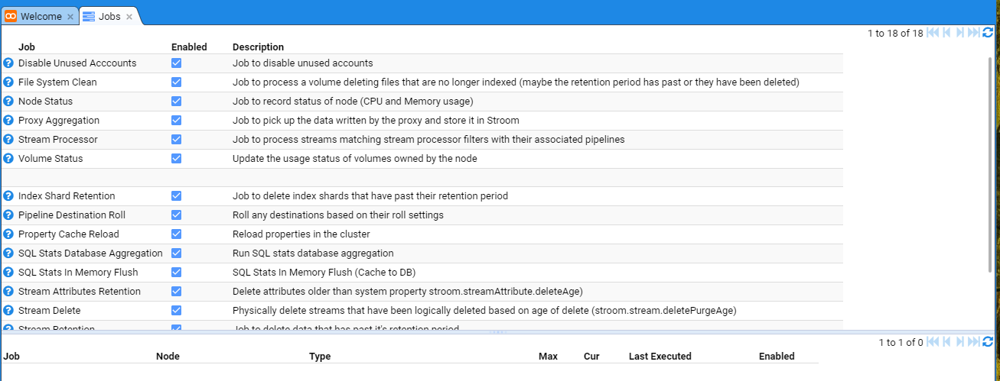
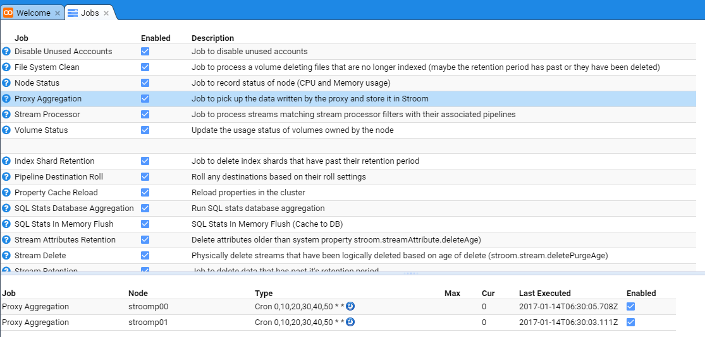
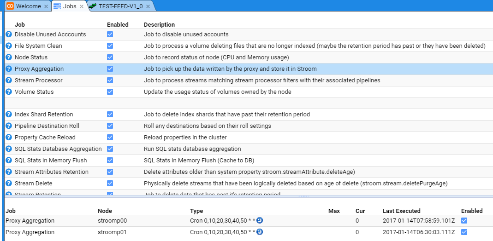
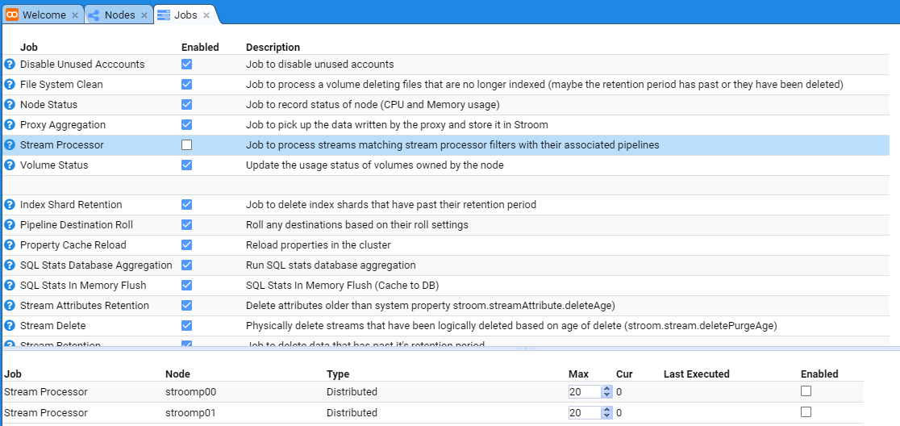
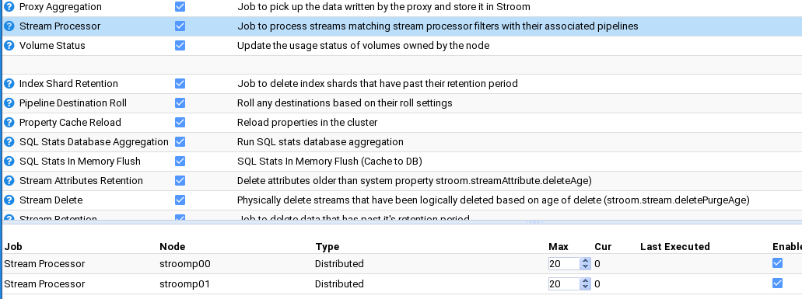
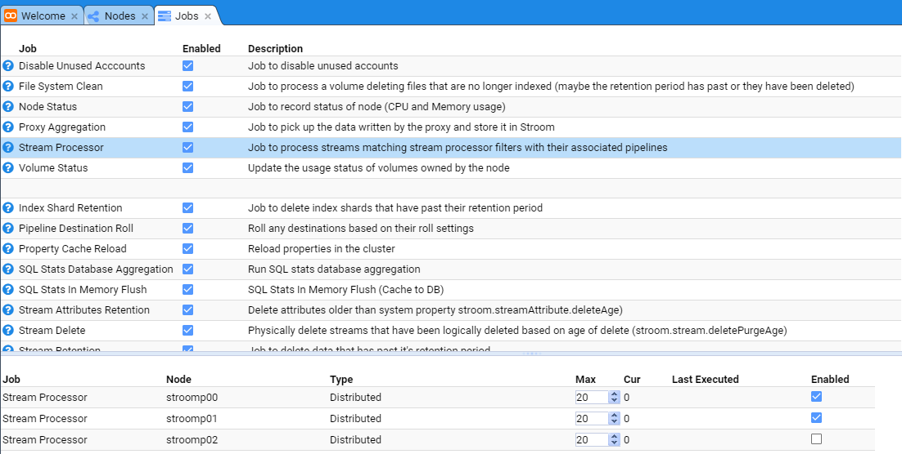
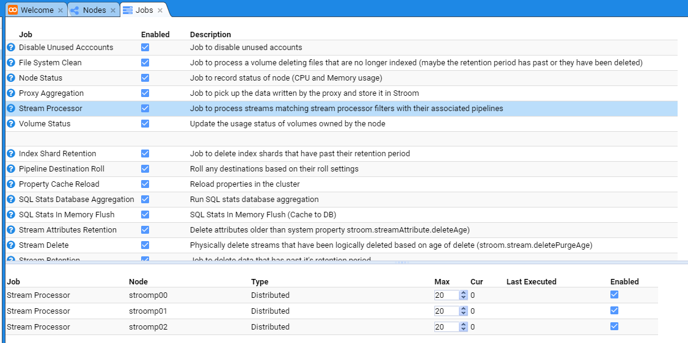

# Stroom HOWTO - Task Maintenance
Various
[Tasks](../../user-guide/tasks.md "Stroom Tasks")
run in the background within Stroom. This HOWTO demonstrates how to manage these tasks

## Assumptions
- All Sections
 - an account with the `Administrator` Application [Permission](../../user-guide/roles.md "Stroom Application Permissions") is currently logged in.
- Proxy Aggregation Tasks
 - we have a multi node Stroom cluster with two nodes, `stroomp00` and `stroomp01`.
- Stream Processor Tasks
 - we have a multi node Stroom cluster with two nodes, `stroomp00` and `stroomp01`.
 - when demonstrating adding a new node to an existing cluster, the new node is `stroomp02`.

## Proxy Aggregation
## Turn Off Proxy Aggregation
We first select the `Monitoring` item of the __Main Menu__ to bring up the `Monitoring` sub-menu.

then move down and select the `Jobs` sub-item to be presented with the `Jobs` configuration tab as seen below.

At this we can select the `Proxy Aggregation` _Job_ whose check-box is selected and the tab will show the individual Stroom Processor nodes
in the deployment.

At this, uncheck the `Enabled` check-boxes for both nodes and also the main Proxy Aggregation check-box to see.

At this point, no new proxy aggregation will occur and any inbound files received by the Store Proxies will accumulate in the proxy storage area.

### Turn On Proxy Aggregation
We first select the `Monitoring` item of the __Main Menu__ to bring up the `Monitoring` sub-menu.

then move down and select the `Jobs` sub-item then select the `Proxy Aggregation` _Job_ to be presented with the `Jobs` configuration tab as seen below.

Now, re-enable each node's `Proxy Aggregation` check-box and the main `Proxy Aggregation` check-box.

After checking the check-boxes, perform a refresh of the display by pressing
the _Refresh_ icon 

on the top right of the lower (node display) pane. You should note the `Last Executed` date/time change to see

.

## Stream Processors
### Enable Stream Processors
To enable the `Stream Processors` task, move to the `Monitoring` item of the __Main Menu__ and select it to bring up the `Monitoring` sub-menu.

then move down and select the `Jobs` sub-item to be presented with the `Jobs` configuration tab as seen below.

At this, we select the `Stream Processor` _Job_ whose check-box is not selected and the tab will show the individual Stroom Processor
nodes in the Stroom deployment.

Clearly, if it was a single node Stroom deployment, you would only see the one node at the bottom of the `Jobs` configuration tab.

We enable nodes nodes by selecting their check-boxes as well as the main `Stream Processors` check-box. Do so.

That is it. Stroom will automatically take note of these changes and internally start each node's Stroom Processor task.

### Enable Stream Processors On New Node

When one expands a Multi Node Stroom cluster deployment, after the installation of the Stroom Proxy and Application software and
services on the new node, we need to enable it's `Stream Processors` task.

To enable the `Stream Processors` for this new node, move to the `Monitoring` item of the __Main Menu__ and select it to bring up the `Monitoring` sub-menu.

then move down and select the `Jobs` sub-item to be presented with the `Jobs` configuration tab as seen below.

At this we select the `Stream Processor` _Job_ whose check-box is selected

We enable the new node by selecting it's check-box.

