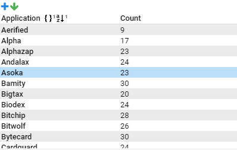
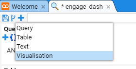
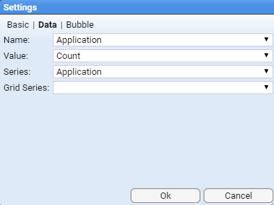
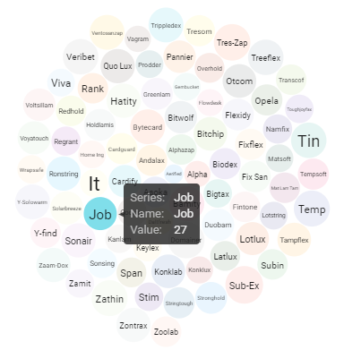

# Stroom Quick-Start Guide - Dashboards

Create a new dashboard the same way you create anything else

On the query pane click the settings button .

Choose the index you just created as your data source.

Now add a term to the query to get a handle on the data

For our simple example we’re using a wildcard that captures all documents with an Id set.

Then in the table panel we can add the fields we are interested in, in this case we wanted to sort the application field and count how many time the application name appears.

Start the query and we should get this

Then we can add an element from the top again and this time use visualisation

In the visualisation panel that opens click the cog on the top right of the panel for settings

In our example we have used the Bubble visualisation

Which gives us this visualisation when the query is executed

Where you can hover over elements and get a summary of that representation.

