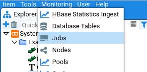

## Getting and Running Stroom

For this quick start you want a simple single-node Stroom. You will want to follow [these instructions](https://github.com/gchq/stroom-docs/blob/master/install-guide/stroom-6-installation.md#running-on-a-single-box). They do require Docker and Docker Compose, so make sure you've installed that first.

At the risk of sowing confusion you should know that there are different ways of running Stroom. Here are the full options:

* [Run using a Docker Hub image (recommended)](/dev-guide/docker-running.md#using-a-pre-built-docker-hub-image)
* [Run using a release](/install-guide/stroom-app-install.md)
* From source you can:
  * [Build and run from IntelliJ](/dev-guide/stroom-in-an-ide.md)
  * [Build and run using Docker](/dev-guide/docker-building.md)

## Basic configuration

### Enable processing of data streams

Automatic processing isn't enabled by default: you might first want to check other settings (for example  nodes, properties, and volumes). So we need to enable Stream Processing. This is in Tools -> Jobs menu::

Next we need to enable Stream Processor jobs:

Below the list of jobs is the properties pane. The Stream Processor's properties show the list of nodes. You should have one. You'll need to enable it by scrolling right:

So now we've done that lets [get data into stroom](../feed/feed.md).
